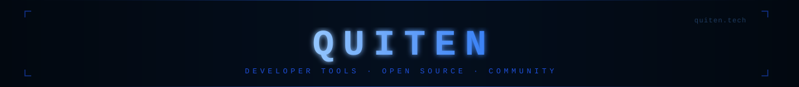

<!-- SEO: Quiten, quiten.tech, Quiten developer tools, Quiten community, Quiten open source -->

<div align="center">
  
</div>

<div align="center">
  
</div>

---

## Quiten — Developer Tools & Community

**Quiten** (`quiten.tech`) is an open-source platform for developers to **share, discover, and build** tools, projects, and resources — built by the community, for the community.

Whether you're publishing a utility you built over a weekend or looking for the right tool for your stack, Quiten is the developer-first space to do it. No noise, no algorithm — just real projects from real engineers.

> **Official website:** [quiten.tech](https://quiten.tech)  
> **GitHub organization:** [github.com/Quitentech](https://github.com/Quitentech)

---

## What is Quiten?

| | |
|:---|:---|
| **Platform** | Discover and share developer projects, tools, and open-source resources |
| **Focus** | Developer-first, community-built, zero bloat |
| **Stack** | TypeScript · Cloudflare · Supabase · Edge infrastructure |
| **Research arm** | [Essential Devs](https://github.com/Essential-Devs) — infrastructure & agentic systems R&D |
| **Lead** | [@fy2ne](https://github.com/fy2ne) |

---

## `// system.notice`
<div align="center">

```
┌──────────────────────────────────────────────────────────────┐
│                    PLATFORM MAINTENANCE                      │
│                                                              │
│  Quiten is currently offline for a full infrastructure       │
│  overhaul. All repositories are temporarily private.         │
│                                                              │
│  Quiten v2 launches on  08 · 08 · 2026                       │
│  — faster, cleaner, rebuilt from the ground up.              │
└──────────────────────────────────────────────────────────────┘
```
<div/>
<div align="center">


</div>

---

## Stack

<div align="center">
  
</div>

---

<div align="center">

**Quiten** is built and maintained by [@fy2ne](https://github.com/fy2ne) and the [Essential Devs](https://github.com/Essential-Devs) research division.

<br/>

[](https://quiten.tech)

</div>
