<!--
  Quiten | quiten.tech | Quiten developer tools | Quiten open source
  Quiten community platform | Quiten projects | quiten tech | Quitentech GitHub
-->

  

  

 

---

# Quiten

**Quiten** is an open-source developer platform at **[quiten.tech](https://quiten.tech)** — built so developers can **share**, **discover**, and **build** tools and community projects without friction.

No algorithms. No curation bias. No noise. Just developers publishing things that matter to other developers.

>  Maintained by [@fy2ne](https://github.com/fy2ne) &nbsp;·&nbsp; Infrastructure research: [Essential Devs](https://github.com/Essential-Devs)

---

## ⬡ &nbsp; What Quiten Does?

 &nbsp;**Developer Tools Registry** — discover and submit real tools the community actually built and ships

 &nbsp;**Open Source Publishing** — Quiten gives your project a place to land where developers look first

 &nbsp;**Edge-Native Infrastructure** — quiten.tech runs entirely on Cloudflare's edge network, zero cold starts

 &nbsp;**Community-Governed** — the Quiten platform is shaped by its users, not by a private roadmap

---

## ⬡ &nbsp; Stack

  

 

---

## ⬡ &nbsp; Platform Notice

>  &nbsp; **quiten.tech is currently offline for a full platform overhaul**
>
> Quiten is being rebuilt from the ground up. All repositories are temporarily private during the rebuild. The Quiten community and the Essential Devs R&D division continue operating internally throughout this period.
>
> **Quiten v2 ships on `08 · 08 · 2026`** — new architecture, faster platform, expanded features.
>
>  &nbsp;

---

**Quiten** — developer tools and community projects, built in the open at [quiten.tech](https://quiten.tech)

 

&nbsp;

&nbsp;

